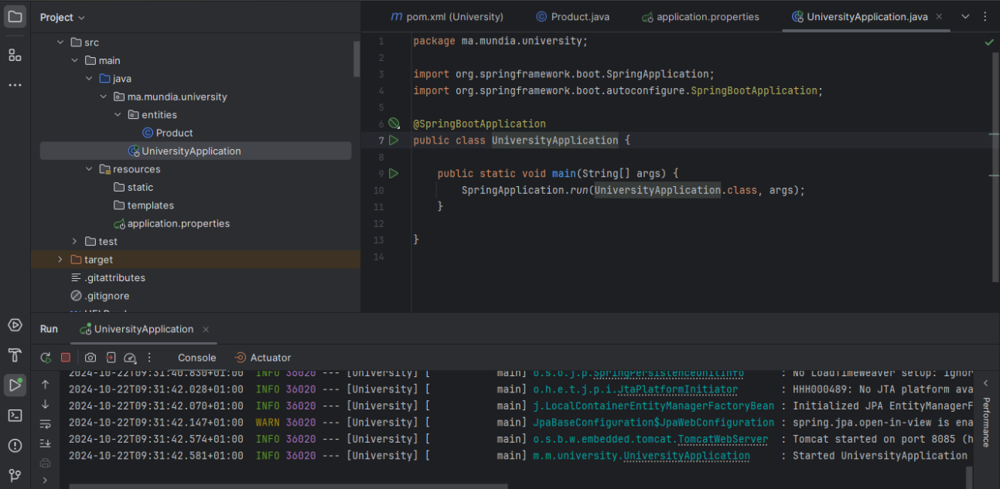
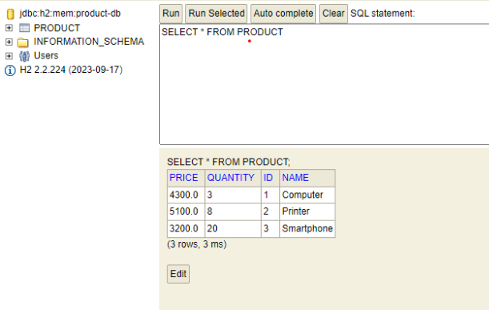
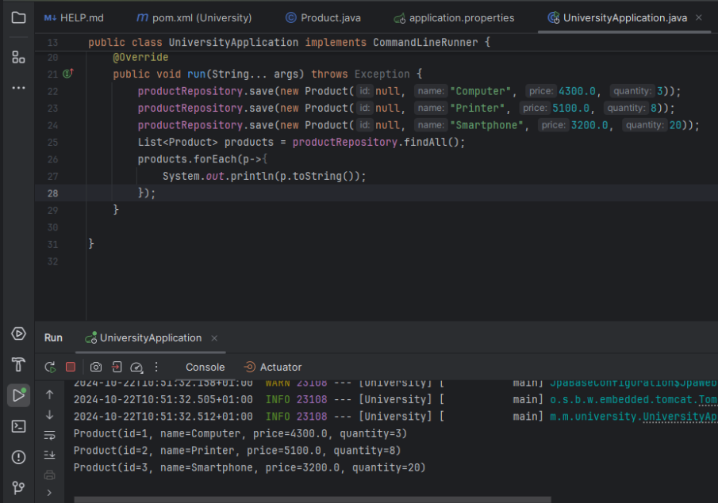
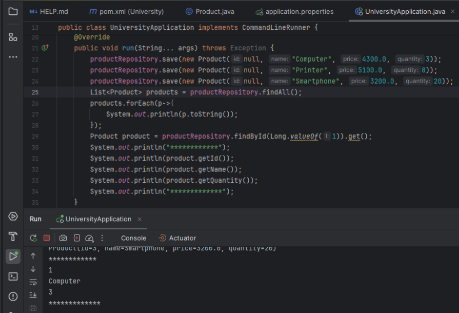
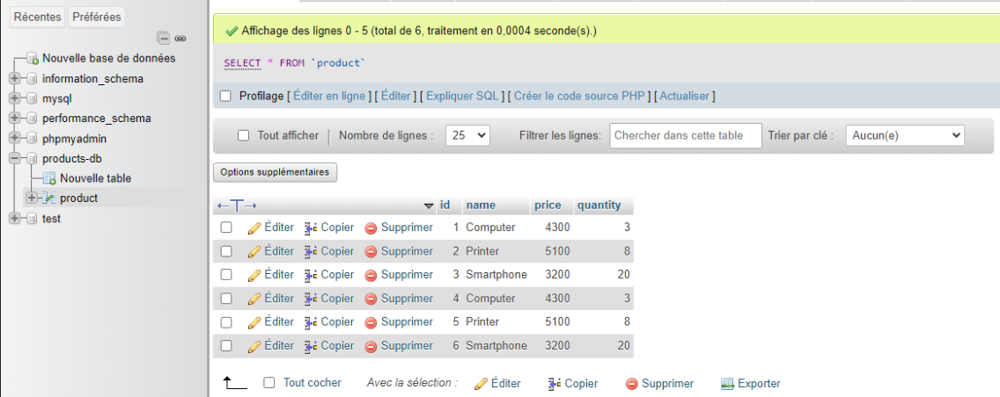
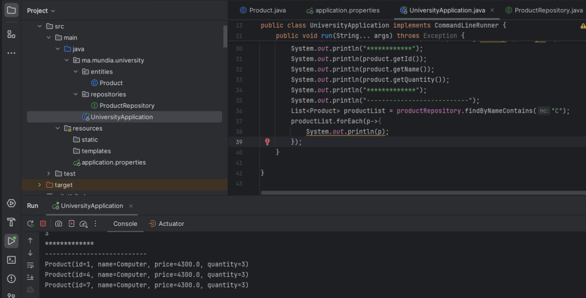
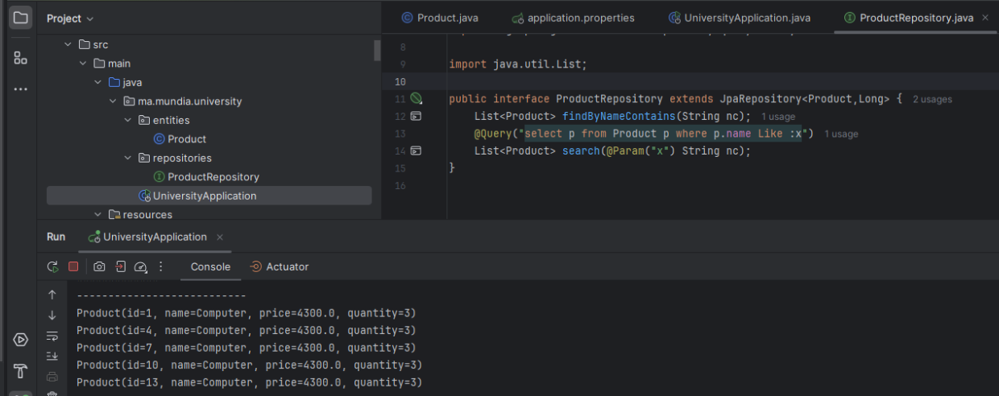
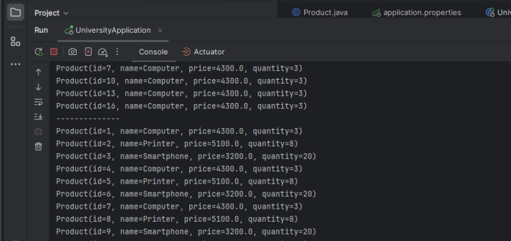
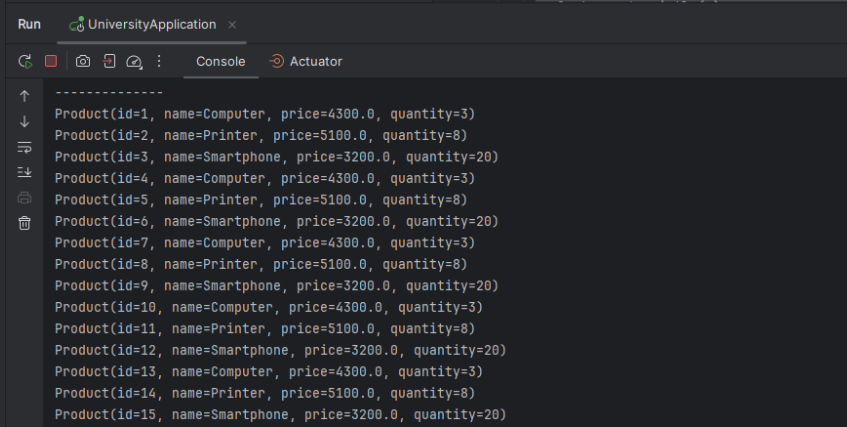
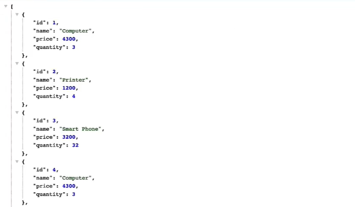

<h1> TP N°3 : ORM JPA Hibernate Spring Data </h1>
<h2> Initialisation du serveur Spring :</h2>

<h2> Création H2 DataBase :</h2>

<h2> Affichage de la liste des produits :</h2>

<h2> Affichage d'un produit grâce à son id :</h2>

<h2> Migration vers SQL DataBase (phpMyAdmin) :</h2>

<h2> Méthode FindByNameContains :</h2>

<h2> Méthode avec @Query :</h2>

<h2> Méthode findByPrice :</h2>

<h2> Méthode avec @Query :</h2>

<h2> Affichage des produits (WebService) : </h2>

<h2> Affichage d'un produit grâce à son id (WebService) : </h2>

